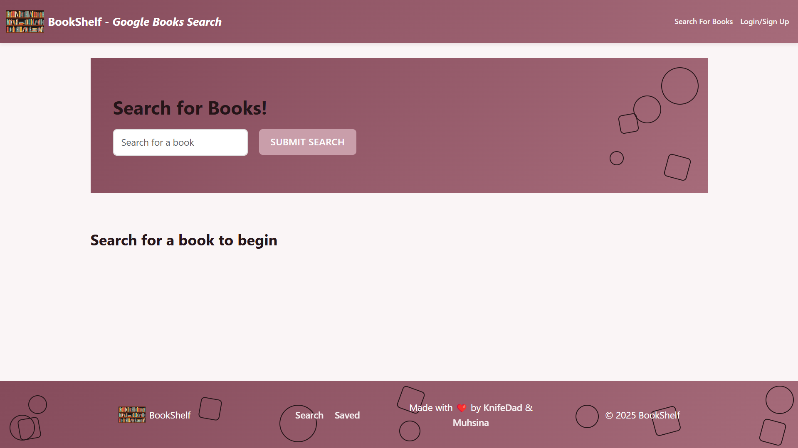

# 📚 BookShelf - Your Personal Literary Universe 🌌


## 📖 Overview

BookShelf is a MERN stack application that allows users to search for books using the Google Books API and save their favorite titles to a personal collection. Built with modern web technologies and a touch of whimsy, BookShelf brings the joy of book discovery to your fingertips!

## 🖥️ Live Demo

[View Live Demo](https://bookshelf-frontend-mp1p.onrender.com/)



## ✨ Features

- 🔍 Search for books using the Google Books API
- 💾 Save books to your personal collection
- 🗑️ Remove books from your collection
- 👤 User authentication with JWT
- 📱 Responsive design for all devices
- 🎨 Beautiful UI with subtle animations

## 🛠️ Technologies Used

- **Frontend**: React, Apollo Client, GraphQL, Bootstrap
- **Backend**: Node.js, Express, MongoDB, Mongoose, GraphQL
- **Authentication**: JWT (JSON Web Tokens)
- **API**: Google Books API

## 🚀 Getting Started

### Prerequisites

- Node.js (v14 or higher)
- MongoDB
- npm

### Installation

1. Clone the repository:
   ```bash
   git clone https://github.com/yourusername/BookShelf.git
   cd BookShelf
   ```

2. Install dependencies for both client and server:
   ```bash
   # Install server dependencies
   cd Develop/server
   npm install

   # Install client dependencies
   cd ../client
   npm install
   ```

3. Set up environment variables:
   Create a `.env` file in the server directory with the following:
   ```
   MONGODB_URI=mongodb://localhost:27017/bookshelf
   JWT_SECRET=your_jwt_secret
   ```

4. Start the development servers:
   ```bash
   # Start the server (from the server directory)
   npm run develop

   # Start the client (from the client directory)
   npm run dev
   ```

5. Open your browser and navigate to `http://localhost:3000`

## 📱 Usage

1. **Sign Up**: Create a new account to get started
2. **Search**: Use the search bar to find books by title, author, or keywords
3. **Save**: Click "Save this Book!" to add a book to your collection
4. **View**: Navigate to "See Your Books" to view your saved collection
5. **Remove**: Click "Delete this Book!" to remove a book from your collection

## 🧩 Project Structure

```
BookShelf/
├── Develop/
│   ├── client/               # React frontend
│   │   ├── src/
│   │   │   ├── components/   # React components
│   │   │   ├── pages/        # Page components
│   │   │   ├── utils/        # Utility functions
│   │   │   └── ...
│   │   └── ...
│   └── server/               # Node.js backend
│       ├── src/
│       │   ├── models/       # Mongoose models
│       │   ├── schemas/      # GraphQL schemas
│       │   ├── utils/        # Utility functions
│       │   └── ...
│       └── ...
└── ...
```

## 👥 Meet Your Bibliophiles

Our team of passionate developers who brought BookShelf to life:

- **Guy Ricketts** (aka KnifeDad) - [@KnifeDad](https://github.com/KnifeDad)
- **Muhsina Shinwari** - [@Muhsina-de](https://github.com/Muhsina-de)

## 🤝 Contributing

Contributions are welcome! Please feel free to submit a Pull Request.

## 📄 License

This project is licensed under the MIT License - see the LICENSE file for details.

## 🙏 Acknowledgments

- EdX Bootcamp for providing the starter code
- Google Books API for providing the book data
- MERN stack community for inspiration and resources
- All the books that made this project possible

---

<p align="center">Made with ❤️ by BookShelf Team</p>